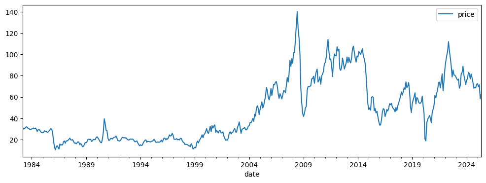
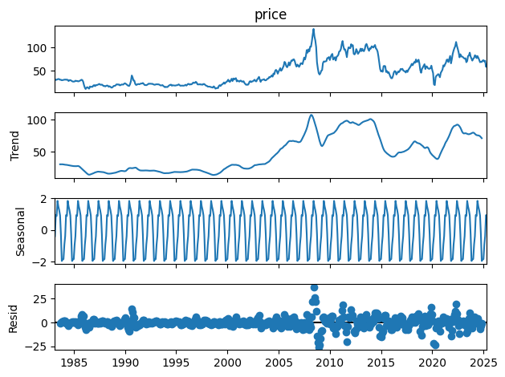
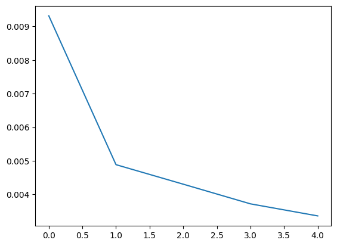
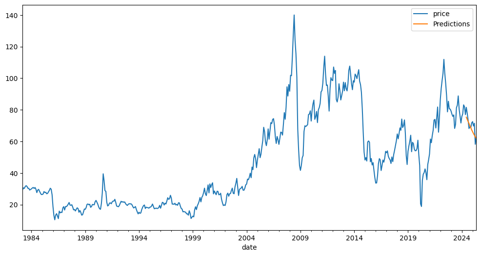
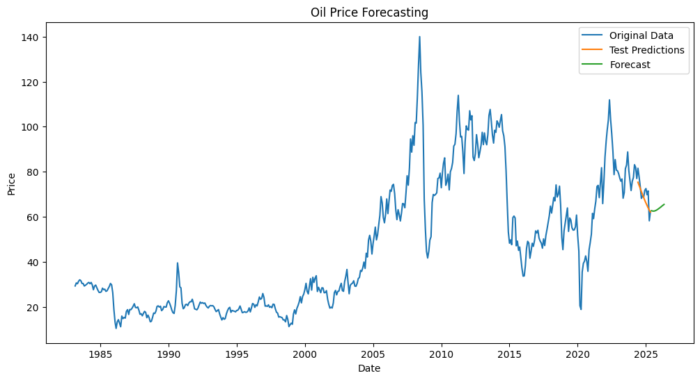

---
jupyter:
  accelerator: GPU
  colab:
    gpuType: T4
  kernelspec:
    display_name: Python 3
    name: python3
  language_info:
    name: python
  nbformat: 4
  nbformat_minor: 0
---

::: {.cell .markdown id="ITDWRj2Q8rQP"}
``{=html}

#AI-Driven Price Forecasting for Oil We have a comprehensive dataset of
worldwide crude oil prices starting from 1983, which includes both the
price changes and their corresponding percentage changes over time. This
historical data provides a valuable foundation for developing a
forecasting solution aimed at predicting oil prices for the upcoming 18
months, enabling better demand planning and market analysis.
:::

::: {.cell .markdown id="UYy6UCBOvdbO"}
#1. SETUP AND REPRODUCIBILITY
:::

::: {.cell .code execution_count="94" id="HxJv33W4Dn_q"}
``` python
import os
import random
import numpy as np
import tensorflow as tf

os.environ['PYTHONHASHSEED'] = '42'
random.seed(42)
np.random.seed(42)
tf.random.set_seed(42)
```
:::

::: {.cell .markdown id="8q3-zUPIvvek"}
#2. DATA LOADING AND EXPLORATION
:::

::: {.cell .code execution_count="95" colab="{\"base_uri\":\"https://localhost:8080/\",\"height\":406}" id="9gA-Cww920S1" outputId="f83f9f62-ee10-42bc-bd8d-a48d7a669afb"}
``` python
import pandas as pd
import matplotlib.pyplot as plt
import numpy as np


df = pd.read_csv('/content/crude-oil-price.csv',index_col='date', parse_dates=True, usecols=['date', 'price'])
df.index.freq = 'MS'

df.plot(figsize=(12, 4))
```

::: {.output .execute_result execution_count="95"}
    <Axes: xlabel='date'>
:::

::: {.output .display_data}

:::
:::

::: {.cell .markdown id="aZnWN4lmv9JY"}
#3. CHECK THE MISSING VALUES
:::

::: {.cell .code execution_count="96" colab="{\"base_uri\":\"https://localhost:8080/\"}" id="mBzMcdOv4vHN" outputId="7577b28d-3506-40c3-e0ad-83fa904a6a4e"}
``` python
print(df.isnull().sum())

# start_date = '1985-01-01'
# end_date = '2000-01-01'
# df = df[(df.index >= start_date) & (df.index <= end_date)]
# df.plot(figsize=(12, 4))
```

::: {.output .stream .stdout}
    price    0
    dtype: int64
:::
:::

::: {.cell .markdown id="I8UdVEka74Xf"}
#4. TIME SERIES DECOMPOSITION
:::

::: {.cell .code execution_count="97" colab="{\"base_uri\":\"https://localhost:8080/\",\"height\":957}" id="XkJlh20f3Oc4" outputId="7423e800-9c44-424a-8869-38aa16c3ca3a"}
``` python
from statsmodels.tsa.seasonal import seasonal_decompose

decompose = seasonal_decompose(df['price'])
decompose.plot()
```

::: {.output .execute_result execution_count="97"}

:::

::: {.output .display_data}

:::
:::

::: {.cell .markdown id="nEU7KINW8Ahu"}
#5. TRAIN-TEST SPLIT
:::

::: {.cell .code execution_count="98" id="9GjX7uBo31Sm"}
``` python
total_size = len(df)
# test_size = int(len(df)*0.15)
test_size = 12

train_set = df[:total_size-test_size]
test_set = df[total_size-test_size:]
```
:::

::: {.cell .markdown id="U6CswJSE8FqW"}
#5. DATA SCALING
:::

::: {.cell .code execution_count="99" id="luHocNVl4xyr"}
``` python
from sklearn.preprocessing import MinMaxScaler

scaler = MinMaxScaler()
scaler.fit(train_set)
scaled_train_set = scaler.transform(train_set)
scaled_test_set = scaler.transform(test_set)
```
:::

::: {.cell .markdown id="OS2ncd_48JuL"}
#6. SEQUENCE GENERATION FOR LSTM
:::

::: {.cell .code execution_count="100" id="xYw37BD15HD-"}
``` python
from tensorflow.keras.preprocessing.sequence import TimeseriesGenerator

n_input = 18 # 18
n_features = 1
generator = TimeseriesGenerator(scaled_train_set, scaled_train_set,
                                length=n_input, batch_size=1) # 1
```
:::

::: {.cell .markdown id="9r_BwxkA8OSO"}
#7. LSTM MODEL CONSTRUCTION
:::

::: {.cell .code execution_count="101" colab="{\"base_uri\":\"https://localhost:8080/\"}" id="MaBPqbSp6jrM" outputId="2912bebe-90cf-4c54-8c82-255e0a913246"}
``` python
from keras.models import Sequential
from keras.layers import Dense, LSTM

model = Sequential()
model.add(LSTM(32, activation='relu', input_shape=(n_input, n_features))) # 32
model.add(Dense(1))
model.compile(optimizer='adam', loss='mse')
```

::: {.output .stream .stderr}
    /usr/local/lib/python3.11/dist-packages/keras/src/layers/rnn/rnn.py:200: UserWarning: Do not pass an `input_shape`/`input_dim` argument to a layer. When using Sequential models, prefer using an `Input(shape)` object as the first layer in the model instead.
      super().__init__(**kwargs)
:::
:::

::: {.cell .code execution_count="102" colab="{\"base_uri\":\"https://localhost:8080/\",\"height\":204}" id="u6JWzyFf6t06" outputId="51a69e04-5417-4d16-8b72-59989d0d7f19"}
``` python
model.summary()
```

::: {.output .display_data}
```{=html}
<pre style="white-space:pre;overflow-x:auto;line-height:normal;font-family:Menlo,'DejaVu Sans Mono',consolas,'Courier New',monospace"><span style="font-weight: bold">Model: "sequential_7"</span>
</pre>
```
:::

::: {.output .display_data}
```{=html}
<pre style="white-space:pre;overflow-x:auto;line-height:normal;font-family:Menlo,'DejaVu Sans Mono',consolas,'Courier New',monospace">┏━━━━━━━━━━━━━━━━━━━━━━━━━━━━━━━━━┳━━━━━━━━━━━━━━━━━━━━━━━━┳━━━━━━━━━━━━━━━┓
┃<span style="font-weight: bold"> Layer (type)                    </span>┃<span style="font-weight: bold"> Output Shape           </span>┃<span style="font-weight: bold">       Param # </span>┃
┡━━━━━━━━━━━━━━━━━━━━━━━━━━━━━━━━━╇━━━━━━━━━━━━━━━━━━━━━━━━╇━━━━━━━━━━━━━━━┩
│ lstm_7 (<span style="color: #0087ff; text-decoration-color: #0087ff">LSTM</span>)                   │ (<span style="color: #00d7ff; text-decoration-color: #00d7ff">None</span>, <span style="color: #00af00; text-decoration-color: #00af00">32</span>)             │         <span style="color: #00af00; text-decoration-color: #00af00">4,352</span> │
├─────────────────────────────────┼────────────────────────┼───────────────┤
│ dense_7 (<span style="color: #0087ff; text-decoration-color: #0087ff">Dense</span>)                 │ (<span style="color: #00d7ff; text-decoration-color: #00d7ff">None</span>, <span style="color: #00af00; text-decoration-color: #00af00">1</span>)              │            <span style="color: #00af00; text-decoration-color: #00af00">33</span> │
└─────────────────────────────────┴────────────────────────┴───────────────┘
</pre>
```
:::

::: {.output .display_data}
```{=html}
<pre style="white-space:pre;overflow-x:auto;line-height:normal;font-family:Menlo,'DejaVu Sans Mono',consolas,'Courier New',monospace"><span style="font-weight: bold"> Total params: </span><span style="color: #00af00; text-decoration-color: #00af00">4,385</span> (17.13 KB)
</pre>
```
:::

::: {.output .display_data}
```{=html}
<pre style="white-space:pre;overflow-x:auto;line-height:normal;font-family:Menlo,'DejaVu Sans Mono',consolas,'Courier New',monospace"><span style="font-weight: bold"> Trainable params: </span><span style="color: #00af00; text-decoration-color: #00af00">4,385</span> (17.13 KB)
</pre>
```
:::

::: {.output .display_data}
```{=html}
<pre style="white-space:pre;overflow-x:auto;line-height:normal;font-family:Menlo,'DejaVu Sans Mono',consolas,'Courier New',monospace"><span style="font-weight: bold"> Non-trainable params: </span><span style="color: #00af00; text-decoration-color: #00af00">0</span> (0.00 B)
</pre>
```
:::
:::

::: {.cell .markdown id="pWR5hTzN8TlY"}
# 8. MODEL TRAINING {#8-model-training}
:::

::: {.cell .code execution_count="103" colab="{\"base_uri\":\"https://localhost:8080/\"}" id="AG8s_bA_63iR" outputId="13d63b1f-231e-49da-fb2d-3a2336db39b4"}
``` python
model.fit(generator, epochs=5) # 10
```

::: {.output .stream .stdout}
    Epoch 1/5
:::

::: {.output .stream .stderr}
    /usr/local/lib/python3.11/dist-packages/keras/src/trainers/data_adapters/py_dataset_adapter.py:121: UserWarning: Your `PyDataset` class should call `super().__init__(**kwargs)` in its constructor. `**kwargs` can include `workers`, `use_multiprocessing`, `max_queue_size`. Do not pass these arguments to `fit()`, as they will be ignored.
      self._warn_if_super_not_called()
:::

::: {.output .stream .stdout}
    477/477 ━━━━━━━━━━━━━━━━━━━━ 4s 3ms/step - loss: 0.0159
    Epoch 2/5
    477/477 ━━━━━━━━━━━━━━━━━━━━ 1s 3ms/step - loss: 0.0050
    Epoch 3/5
    477/477 ━━━━━━━━━━━━━━━━━━━━ 1s 3ms/step - loss: 0.0055
    Epoch 4/5
    477/477 ━━━━━━━━━━━━━━━━━━━━ 1s 3ms/step - loss: 0.0032
    Epoch 5/5
    477/477 ━━━━━━━━━━━━━━━━━━━━ 3s 3ms/step - loss: 0.0034
:::

::: {.output .execute_result execution_count="103"}
    <keras.src.callbacks.history.History at 0x7a68c74736d0>
:::
:::

::: {.cell .code execution_count="104" colab="{\"base_uri\":\"https://localhost:8080/\",\"height\":448}" id="7AzC12d-7NB6" outputId="3f211128-d40c-484b-94bb-1f4afa3bdb78"}
``` python
loss_per_epoch = model.history.history['loss']
plt.plot(range(len(loss_per_epoch)), loss_per_epoch)
```

::: {.output .execute_result execution_count="104"}
    [<matplotlib.lines.Line2D at 0x7a68c744ab50>]
:::

::: {.output .display_data}

:::
:::

::: {.cell .code execution_count="105" colab="{\"base_uri\":\"https://localhost:8080/\"}" id="hdXqb3TU8QRY" outputId="5c80dd9f-cdd6-4a8e-b49b-388a00f4ba37"}
``` python
last_train_batch = scaled_train_set[-n_input:]
last_train_batch = last_train_batch.reshape((1, n_input, n_features))
model.predict(last_train_batch)
```

::: {.output .stream .stdout}
    1/1 ━━━━━━━━━━━━━━━━━━━━ 0s 307ms/step
:::

::: {.output .execute_result execution_count="105"}
    array([[0.5009131]], dtype=float32)
:::
:::

::: {.cell .markdown id="xYhDiAQY8bGG"}
#9. FORECASTING AND PREDICTIONS
:::

::: {.cell .code execution_count="106" colab="{\"base_uri\":\"https://localhost:8080/\"}" id="O_n4i40t8yWS" outputId="15668ec8-8e87-4c06-a5a3-9c9d2446ef72"}
``` python
test_predictions = []
first_eval_batch = scaled_train_set[-n_input:]
current_batch = first_eval_batch.reshape((1, n_input, n_features))

for i in range(len(test_set)):
  current_pred = model.predict(current_batch)[0]
  test_predictions.append(current_pred)
  current_batch = np.append(current_batch[:, 1:, :], [[current_pred]], axis=1)
```

::: {.output .stream .stdout}
    1/1 ━━━━━━━━━━━━━━━━━━━━ 0s 27ms/step
    1/1 ━━━━━━━━━━━━━━━━━━━━ 0s 28ms/step
    1/1 ━━━━━━━━━━━━━━━━━━━━ 0s 28ms/step
    1/1 ━━━━━━━━━━━━━━━━━━━━ 0s 30ms/step
    1/1 ━━━━━━━━━━━━━━━━━━━━ 0s 29ms/step
    1/1 ━━━━━━━━━━━━━━━━━━━━ 0s 28ms/step
    1/1 ━━━━━━━━━━━━━━━━━━━━ 0s 27ms/step
    1/1 ━━━━━━━━━━━━━━━━━━━━ 0s 28ms/step
    1/1 ━━━━━━━━━━━━━━━━━━━━ 0s 34ms/step
    1/1 ━━━━━━━━━━━━━━━━━━━━ 0s 29ms/step
    1/1 ━━━━━━━━━━━━━━━━━━━━ 0s 27ms/step
    1/1 ━━━━━━━━━━━━━━━━━━━━ 0s 28ms/step
:::
:::

::: {.cell .code execution_count="107" id="1LOXlc_V9OEm"}
``` python
true_predictions = scaler.inverse_transform(test_predictions)
```
:::

::: {.cell .code execution_count="108" colab="{\"base_uri\":\"https://localhost:8080/\"}" id="D57fkeAu9ZmX" outputId="bf03f570-8541-4492-a90c-551535fa1680"}
``` python
test_set['Predictions'] = true_predictions
```

::: {.output .stream .stderr}
    <ipython-input-108-22ce99fad483>:1: SettingWithCopyWarning: 
    A value is trying to be set on a copy of a slice from a DataFrame.
    Try using .loc[row_indexer,col_indexer] = value instead

    See the caveats in the documentation: https://pandas.pydata.org/pandas-docs/stable/user_guide/indexing.html#returning-a-view-versus-a-copy
      test_set['Predictions'] = true_predictions
:::
:::

::: {.cell .code execution_count="109" colab="{\"base_uri\":\"https://localhost:8080/\",\"height\":560}" id="6zUQ-JxZ9g6w" outputId="89264077-a7b8-4a13-e170-3670979f3470"}
``` python
full_set = pd.concat([train_set, test_set])
full_set.plot(figsize=(12, 6))
```

::: {.output .execute_result execution_count="109"}
    <Axes: xlabel='date'>
:::

::: {.output .display_data}

:::
:::

::: {.cell .markdown id="QDZtn6OA8fSV"}
#10. MODEL EVALUATION
:::

::: {.cell .code execution_count="110" colab="{\"base_uri\":\"https://localhost:8080/\"}" id="s86NAHtv9yih" outputId="88dc4aa2-c300-480a-d6e8-238387458191"}
``` python
from sklearn.metrics import mean_squared_error
from math import sqrt

rmse = sqrt(mean_squared_error(test_set['price'], test_set['Predictions']))
print(rmse)
print("#"*32)
print(test_set)
```

::: {.output .stream .stdout}
    4.358564419943234
    ################################
                                 price  Predictions
    date                                           
    2024-06-01 00:00:00+00:00  81.5400    75.328317
    2024-07-01 00:00:00+00:00  77.9100    73.985567
    2024-08-01 00:00:00+00:00  73.5500    72.617140
    2024-09-01 00:00:00+00:00  68.1700    71.242398
    2024-10-01 00:00:00+00:00  69.2600    69.888395
    2024-11-01 00:00:00+00:00  68.6300    68.579196
    2024-12-01 00:00:00+00:00  71.7200    67.310769
    2025-01-01 00:00:00+00:00  72.5300    66.104672
    2025-02-01 00:00:00+00:00  69.7600    64.978830
    2025-03-01 00:00:00+00:00  71.4800    63.928911
    2025-04-01 00:00:00+00:00  58.2100    62.966049
    2025-05-01 00:00:00+00:00  62.2914    62.075000
:::
:::

::: {.cell .markdown id="P-FxB3jJ8iLL"}
#11. MODEL SAVING
:::

::: {.cell .code execution_count="111" id="PczRy5ruBd5I"}
``` python
model.save('model.keras')
```
:::

::: {.cell .markdown id="jmWAkLbH5D2K"}
# PREDICTION PRICE FOR 2026
:::

::: {.cell .code execution_count="112" colab="{\"base_uri\":\"https://localhost:8080/\"}" id="ONPCIdkN8hZU" outputId="16f4cb78-f407-48be-f69e-06bc6af70fe9"}
``` python
# retrain the model with the test dataset
forecast = []
scaled_full_set = np.concatenate((scaled_train_set, scaled_test_set))

full_generator = TimeseriesGenerator(scaled_full_set, scaled_full_set,
                                length=n_input, batch_size=1)

model.fit(full_generator, epochs=4)
```

::: {.output .stream .stdout}
    Epoch 1/4
     43/489 ━━━━━━━━━━━━━━━━━━━━ 1s 4ms/step - loss: 0.0049
:::

::: {.output .stream .stderr}
    /usr/local/lib/python3.11/dist-packages/keras/src/trainers/data_adapters/py_dataset_adapter.py:121: UserWarning: Your `PyDataset` class should call `super().__init__(**kwargs)` in its constructor. `**kwargs` can include `workers`, `use_multiprocessing`, `max_queue_size`. Do not pass these arguments to `fit()`, as they will be ignored.
      self._warn_if_super_not_called()
:::

::: {.output .stream .stdout}
    489/489 ━━━━━━━━━━━━━━━━━━━━ 2s 3ms/step - loss: 0.0032
    Epoch 2/4
    489/489 ━━━━━━━━━━━━━━━━━━━━ 2s 3ms/step - loss: 0.0024
    Epoch 3/4
    489/489 ━━━━━━━━━━━━━━━━━━━━ 1s 3ms/step - loss: 0.0028
    Epoch 4/4
    489/489 ━━━━━━━━━━━━━━━━━━━━ 2s 4ms/step - loss: 0.0020
:::

::: {.output .execute_result execution_count="112"}
    <keras.src.callbacks.history.History at 0x7a68c6f6f510>
:::
:::

::: {.cell .code execution_count="113" colab="{\"base_uri\":\"https://localhost:8080/\",\"height\":840}" id="ZkcBJOxH5K-Q" outputId="18b04175-a07e-4c8b-a32c-b8fa33d4f968"}
``` python
# predict

first_forecast_batch = scaled_full_set[-n_input:]

current_batch = first_forecast_batch.reshape((1, n_input, n_features))

# Predict the next 48 months (as specified in the original code)
for i in range(12):
    current_pred = model.predict(current_batch, verbose=0)[0] # Added verbose=0 to reduce output
    forecast.append(current_pred)
    # Update the current_batch to include the prediction and drop the oldest value
    current_batch = np.append(current_batch[:, 1:, :], [[current_pred]], axis=1)

# Inverse transform the forecast
forecast = scaler.inverse_transform(forecast)

# Create a date index for the forecast
last_date = df.index[-1]
# The forecast starts from the month *after* the last date in the original df
forecast_index = pd.date_range(start=last_date, periods=len(forecast) + 1, freq='MS')[1:]

# Create a DataFrame for the forecast
forecast_df = pd.DataFrame(forecast, index=forecast_index, columns=['Forecast'])

# Plot the original data, test set with predictions, and the forecast
plt.figure(figsize=(12, 6))
plt.plot(df['price'], label='Original Data')
plt.plot(test_set['Predictions'], label='Test Predictions') # Keep test predictions for comparison
plt.plot(forecast_df['Forecast'], label='Forecast') # Changed label to 'Forecast'
plt.title('Oil Price Forecasting')
plt.xlabel('Date')
plt.ylabel('Price')
plt.legend()
plt.show()

print("#"*32)
print(f"{len(forecast)} Month Forecast:") # Print the actual number of months forecasted
print(forecast_df.head()) # Print the first few months of the forecast
print("...")
print(forecast_df.tail()) # Print the last few months of the forecast
```

::: {.output .display_data}

:::

::: {.output .stream .stdout}
    ################################
    12 Month Forecast:
                                Forecast
    2025-06-01 00:00:00+00:00  62.696484
    2025-07-01 00:00:00+00:00  62.526180
    2025-08-01 00:00:00+00:00  62.510972
    2025-09-01 00:00:00+00:00  62.633684
    2025-10-01 00:00:00+00:00  62.861777
    ...
                                Forecast
    2026-01-01 00:00:00+00:00  63.897422
    2026-02-01 00:00:00+00:00  64.294993
    2026-03-01 00:00:00+00:00  64.696623
    2026-04-01 00:00:00+00:00  65.093707
    2026-05-01 00:00:00+00:00  65.478205
:::
:::
